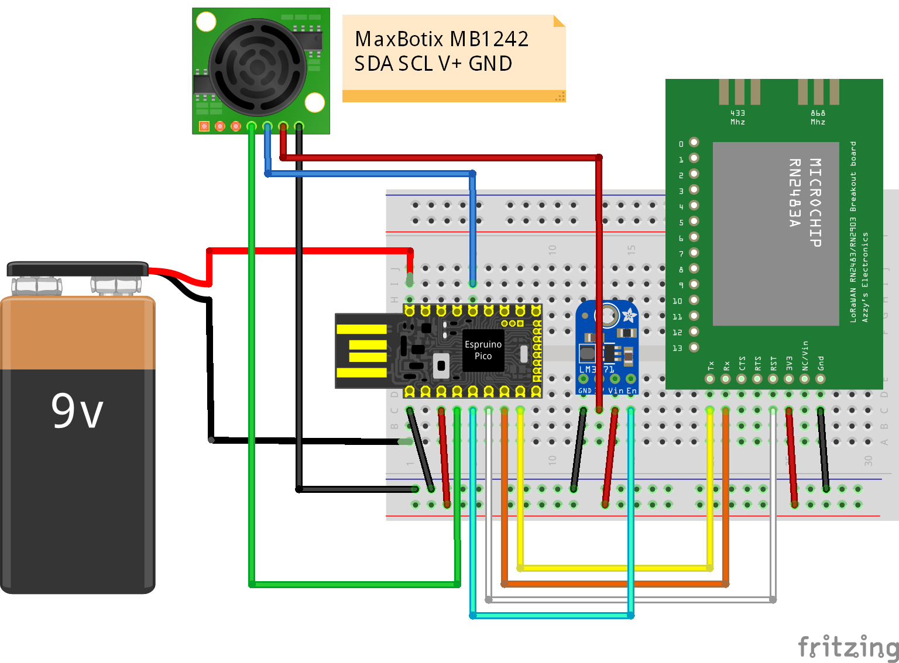
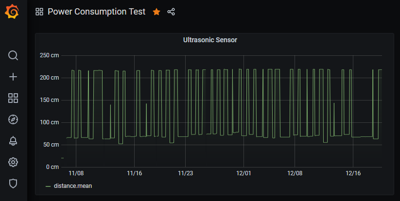
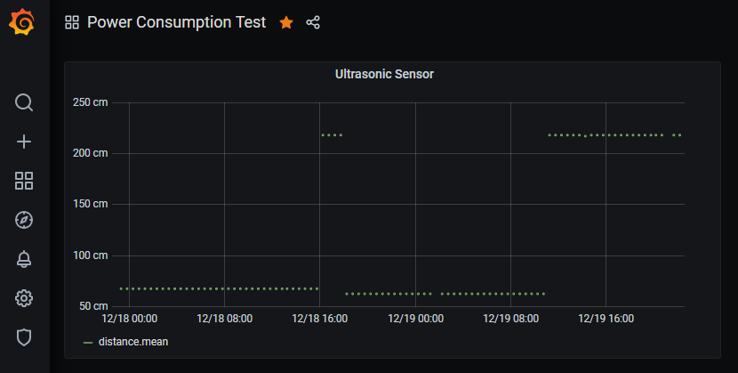

# espruino-pico-rn2483-ttn-basic
Simple LoRaWAN node connected to [The Things Network (TTN)](https://www.thethingsnetwork.org/) 
using [Espruino Pico](http://www.espruino.com/Pico)
and Microchip [RN2483 LoRa Technology Module](https://www.microchip.com/wwwproducts/en/RN2483). 
As sensor a [MB1242 I2CXL-MaxSonar-EZ4](https://www.maxbotix.com/ultrasonic_sensors/mb1242.htm) is used, that is connected via I2C. 
It returns the distance in centimeter as an array of 2 bytes.
  
The most prominent goal was to find out how to design a device and its
software in order to minimize the energy consumption in order to maximize
battery life.

## Motivation
* In many cases, LoRaWAN nodes are deployed in remote places **without**
  **a static power supply**. So both hardware and software need to be
  designed in a way that allows battery operation.
* With battery operation, operation of at least 1 year should be
  technically feasible these days, given that sending sensor values
  only a few times per day is good enough for the given use case.
* The Espruino Pico already has some [operational modes for power saving](https://www.espruino.com/Power+Consumption),
  the goal is to find out how these modes can be used.
* Also the RN2483 can be sent to sleep in order to minimize power consumption.
  The goal is how to find out how to send this module to sleep and wake it up
  again, and what implications this has to the current connection to TTN. 

Last but not least ...

* Be a cool guy and [program a microcontroller with JavaScript](https://www.espruino.com/).

## Wiring
I use a RN2483A/RN2903A breakout board that I ordered for about €30 at Tindie:
https://www.tindie.com/products/DrAzzy/lorawan-rn2483rn2903-breakout-board-assembled/

[RN2483 Breakout Board Pinout](https://www.tindie.com/products/drazzy/lorawan-rn2483rn2903-breakout-board-assembled/)

**Level Shifter Option:** As the Espruino Pico already operates at 3.3V, there
should be no need for a level shifter. However, if you like to play around
with this module by simply attaching a (FTDI) Serial-to-UART cable which 
has 5v levels, then you probably want to have a level shifter and a voltage
regulator at hand.

The Espruino Pico gets its power from a 9V battery. It has a built-in voltage
regulator that converts the volate to 3.3V.
[Espruino Pico Pinout](http://www.espruino.com/Pico)

The MaxBotix MB1242 consumes a consiberable amount energy, even in idle mode, 
so a [Adafruit LM3671 3.3V Buck Converter Breakout](https://www.adafruit.com/product/2745) is used as kind of "switch" to cut-off the power supply for this 
sensor when it is not in use. Yes, people say that cutting off the power
supply is **not sufficient** to make sure that the MB1242 really no longer
consumes any energy, but in my case this trick was very effective.

## Preparation in TTN Console
https://console.thethingsnetwork.org/
You first need to create an application in [TTN console](https://console.thethingsnetwork.org/), and create a device within this application.

Select OTAA (Over the Air Activation) as *Activation Mode*

After creation of the device, copy and paste the values for *Device EUI*, 
*Application EUI* and *App Key* to the code:

    // LoRaWAN Over the Air Activation (OTAA)
    // Copy these values from the Device Overview of the TTN console.
    const deviceOTAAConfiguration = {
      'deviceEUI': '0000000000000000',
      'applicationEUI': '0000000000000000',
      'appKey': '00000000000000000000000000000000'
    };

## Transfer code to Espruino Pico and run it
I won't explain here how you work in general with Espruino products, you already should be familiar with that or make yourself familiar by other means than this 
project.

* Connect the Espruino Pico via USB, 
* use the [Espruino Web IDE](https://www.espruino.com/Web+IDE) to transfer the code (I still use the native version for Windows)
* Run the code by entering *onInit();* on the Pico

Note that the Pico won't go into *stop* mode until connected to USB. You need to
connect a battery (or another power source) to try that out.

https://www.espruino.com/Power+Consumption

## Example output
     ____                 _
    |  __|___ ___ ___ _ _|_|___ ___
    |  __|_ -| . |  _| | | |   | . |
    |____|___|  _|_| |___|_|_|_|___|
             |_| espruino.com
     2v06 (c) 2019 G.Williams
    >
    >onInit();
    =undefined
    ["sys get ver\r\n"
    ] "R"
    ] "N2483 1.0.5 Oct"
    ] " 31 2018 15:06:5"
    ] "2\r\n"
    Version: RN2483 1.0.5 Oct 31 2018 15:06:52
    ["mac reset 868\r\n"
    ] "o"
    ] "k\r\n"
    ["mac set adr on\r\n"
    ] "o"
    ] "k\r\n"
    ["mac set appeui 70B3D57EXXXXXXXX\r\n"
    ] "o"
    ] "k\r\n"
    ["mac set deveui 00022CBFXXXXXXXX\r\n"
    ] "o"
    ] "k\r\n"
    ["mac set appkey 625C109CA95ADA37E9D0EA64XXXXXXXX\r\n"
    ] "o"
    ] "k\r\n"
    ["mac join otaa\r\n"
    ] "o"
    ] "k\r\n"
    ] "a"
    ] "ccepted\r\n"
    Result: accepted
    RN2483 go to sleep
    ["sys sleep 86400000\r\n"
    RN2483 sent to sleep
    Periodic task started.
    RN2483 wake up
    ] "\u0000"
    ] "ok\r\n"
    ["\r\n"
    ] "inv"
    ] "alid_param\r\n"
    wake up finished
    ["mac tx uncnf 1 42\r\n"
    ] "o"
    ] "k\r\n"
    ] "m"
    ] "ac_tx_ok\r\n"
    RN2483 go to sleep
    ["sys sleep 86400000\r\n"
    Periodic task done.
    > 

## Results

* The experiment up to now runs for more than 6 weeks now, longer than
  any battery powered circuit I did before.
* Maybe it could be even more power-efficient if we could eliminate the 
  voltage regulator on the Espruino Pico and use an appropriate battery instead
* The Microchip RN2483 module has quite helpful in keeping the complexity
  of the LoRaWAN protocol away from the project, especially suprised with
  its *duty cycle* enforcing mechanisms and *adaptive data rate* functionality. It also has a nice functionality to send it to sleep
  and wake it up when needed again.
  https://www.thethingsnetwork.org/docs/lorawan/duty-cycle.html

To visualize the measurements, I used 
* [Node-RED](https://nodered.org/)
* [Application Nodes for "The Things Network"](https://flows.nodered.org/node/node-red-contrib-ttn)
* [Node-RED nodes to save and query data from an influxdb time series database](https://flows.nodered.org/node/node-red-contrib-influxdb)
* [InfluxDB](https://www.influxdata.com/)
* [Grafana](https://grafana.com/)

Running now for more then 6 weeks, hanging on the ceiling of my garage

Sending a distance value every 30 minutes (well, there are some few losses)

Some similar project with focus on energy consumption and also using
an ultrasonic sensor can be found here:

https://www.hackster.io/Amedee/low-power-water-level-sensor-for-lorawan-the-things-network-96c877

